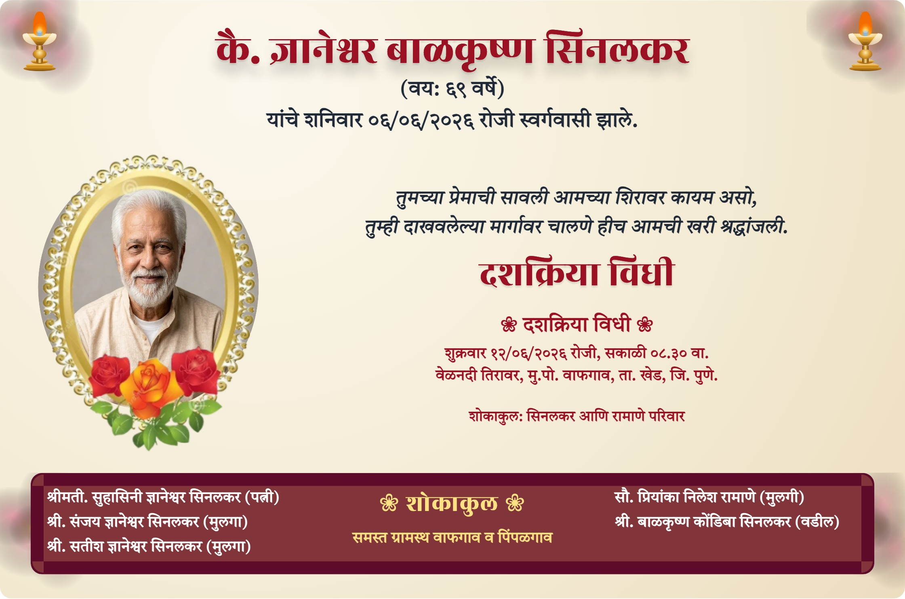
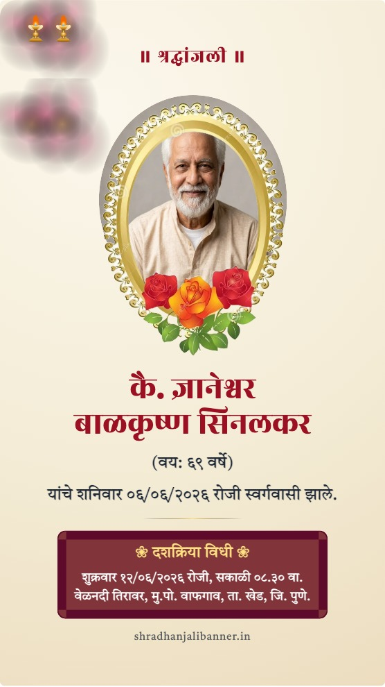
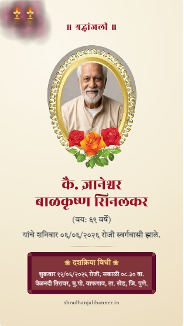
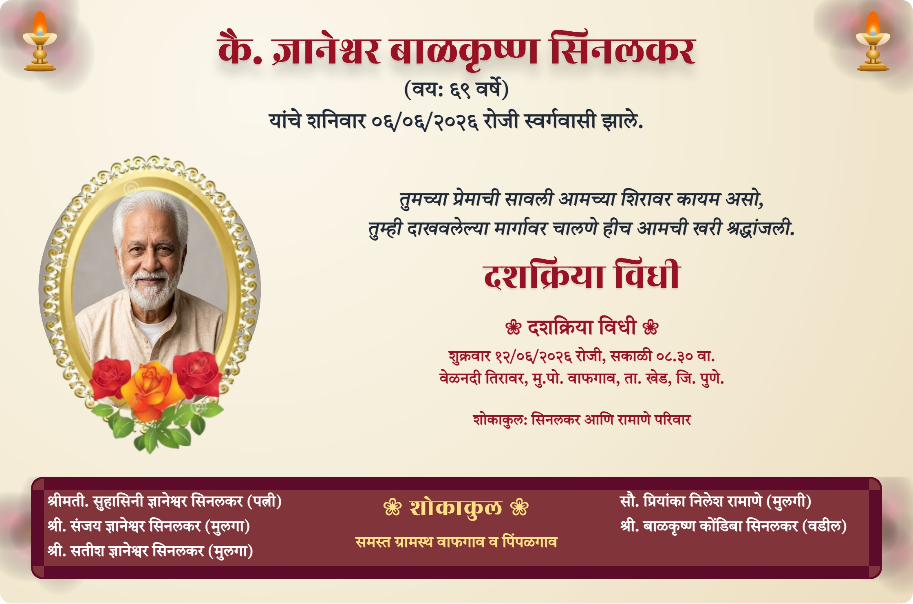

# 🌸 श्रद्धांजलि बॅनर (Shradhanjali Banner Maker)

[](https://shradhanjalibanner.in/)
[](https://opensource.org/licenses/MIT)
[](https://shradhanjalibanner.in/)
[](https://shradhanjalibanner.in/)
[](https://shradhanjalibanner.in/)

> **विनामूल्य श्रद्धांजलि बॅनर जनरेटर** — ११ प्रमुख भारतीय भाषांमध्ये भावपूर्ण बॅनर तयार करा.
> A free, respectful, privacy-first online memorial and funeral tribute banner creator supporting 11 major Indian languages with instant HD downloads.

---

## 🌺 About Shradhanjali Banner Maker

**Shradhanjali Banner Maker** (श्रद्धांजलि बॅनर) is designed to help families and local print shop operators create dignified, high-resolution printable and shareable memorial announcement banners (*भावपूर्ण श्रद्धांजली बॅनर*) within minutes.

Built with deep cultural reverence for traditional Maharashtrian & Indian rituals, the application features Devanagari-first typography, devotional color palettes (anchored around warm marigolds, ritual parchment, and deep plums), and runs **100% locally inside your browser** with zero server data uploads.

---

## ✨ Features & Highlights

### 🌐 1. 12 Major Indian Languages with Automatic Prefill
- Supports full native language generation across **11 Indian languages**:
  - 🇲🇷 **मराठी (Marathi)**: *भावपूर्ण श्रद्धांजली बॅनर*
  - 🇮🇳 **हिन्दी (Hindi)**: *भावपूर्ण श्रद्धांजलि बैनर*
  - 🇬🇧 **English**: *Memorial Tribute Banner*
  - 🇧🇩 **বাংলা (Bengali)**: *বিনম্র শ্রদ্ধাঞ্জলি ব্যানার*
  - 🇮🇳 **తెలుగు (Telugu)**: *భావపూర్వక శ్రద్ధాంజలి బ్యానర్*
  - 🇮🇳 **தமிழ் (Tamil)**: *கண்ணீர் நினைவஞ்சலி பேனர்*
  - 🇮🇳 **ગુજરાતી (Gujarati)**: *ભાવપૂર્ણ શ્રદ્ધાંજલિ બેનર*
  - 🇮🇳 **ಕನ್ನಡ (Kannada)**: *ಭಾವಪೂರ್ಣ ಶ್ರದ್ಧಾಂజಲಿ ಬ್ಯಾನർ*
  - 🇮🇳 **മലയാളം (Malayalam)**: *ഹൃദയംഗമമായ ആദരാഞ്ജലി ബാനർ*
  - 🇮🇳 **ਪੰਜਾਬੀ (Punjabi)**: *ਭਾਵਪੂਰਤ ਸ਼ਰਧਾਂਜਲੀ ਬੈਨਰ*
  - 🇮🇳 **ଓଡ଼ିଆ (Odia)**: *ଭାବପୂର୍ଣ୍ଣ ଶ୍ରଦ୍ଧାଞ୍ଜଳି ବ୍ୟାନର*
- **Instant Translation & Auto-Prefill**: Switching language dropdowns automatically translates header titles, form placeholders, ritual quotes (*दशक्रिया विधी*, *श्रद्धांजलि सभा*, *Condolence Meet*), and sample profile data into the chosen native script.

---

### 🎨 2. 11 Handcrafted Devotional Themes & 7 Photo Frames
- **11 Themes**: Traditional Parchment, Sunset Twilight, Ocean Waves, Classic Grayscale, Golden Ember, Ethereal Lavender, Marigold Yellow, Saffron, Sacred Tulsi, Rose Crimson, Ivory Parchment.
- **7 Decorative Photo Frames**: Gold Ring, Pearl Garland, Lotus Blossom, Silver Polish, Traditional Filigree, and more.

---

### 📱 3. Multi-Format Downloads & Animated Video Status
- **Print Banner (Landscape)**: Standard high-resolution banner layout for printing.
- **Flex Print (फिक्स साईज)**: Custom flex banner sizes (2x3, 3x4, 4x6, 6x4 ft) at **72 / 150 / 300 DPI** for large outdoor venue hoardings (*कमान व स्टँडी*).
- **WhatsApp Status & Instagram Story (9:16)**: Mobile portrait layout (1080×1920 px).
- **Instagram Post (1:1)**: Square layout (1080×1080 px).
- **🎞️ Animated Video Status**: Export animated WebM/MP4 status videos featuring glowing flames and falling petals for social sharing.

---

### 🔒 4. 100% Privacy-First & Offline Ready
- **Zero Photo Uploads**: Your family photos and memorial text **never leave your device**. All processing happens 100% in your local browser memory.
- **No Sign-Up / No Ads / No Watermark**: Free instant access without registrations or intrusive branding.
- **Offline PWA Support**: Functions even when internet connectivity is limited.

---

## 🖼️ Resolution Format Banner Screenshots

Below are actual cropped banner card previews and specs for each format supported by **Shradhanjali Banner Maker**:

### 1. 🖨️ Standard Print Banner (High-Res HD Sample)

- **Format Label**: `Standard Print Banner (High-Res HD)`
- **Aspect Ratio**: Landscape (`4:3` / `16:9` printable ratio)
- **Best For**: Family distribution, A4/A3 paper printouts, frame placement.
- **Includes**: Deceased portrait photo, name, age, death date & time, ritual quote, ceremony location, preacher details, village list, and family list.

---

### 2. 📱 WhatsApp Status & Instagram Story (9:16 Portrait Sample)

- **Format Label**: `WhatsApp Status & IG Story (9:16 Portrait)`
- **Dimensions**: `1080 × 1920 px` (High DPI mobile screen layout)
- **Best For**: WhatsApp Status updates, Instagram Stories, Facebook Stories.
- **Includes**: Portrait photo, name, age, death date, ceremony timing, and tribute message optimized for vertical smartphone screens.

---

### 3. 📸 Instagram Post (1:1 Square Feed Sample)

- **Format Label**: `Instagram & Facebook Post (1:1 Square)`
- **Dimensions**: `1080 × 1080 px` (Square social feed ratio)
- **Best For**: Instagram feed posts, Facebook feed posts, memorial gallery cards.
- **Includes**: Balanced square layout highlighting deceased portrait, title, and ceremony details.

---

### 4. 🎪 Outdoor Flex Print Banner (Venue Hoarding 4x6 ft Sample)

- **Format Label**: `Outdoor Flex Print Banner (Venue Hoarding & Standee)`
- **Custom Flex Sizes**: `2×3 ft`, `3×4 ft`, `4×6 ft`, `6×4 ft`
- **Print Resolution**: Customizable **72 DPI** (draft), **150 DPI** (standard flex), or **300 DPI** (ultra-sharp high quality flex print)
- **Best For**: Large outdoor flex hoardings, ceremony venue entrance arches (*स्वागत कमान*), tripod standees (*स्टँडी प्रिव्ह्यू*).

---

## 📋 How to Create a Memorial Banner in 3 Steps

```
┌───────────────────────────┐      ┌───────────────────────────┐      ┌───────────────────────────┐
│  1. Choose Theme & Frame  │ ───► │   2. Enter Details & Photo│ ───► │  3. Download HD Image/Video│
└───────────────────────────┘      └───────────────────────────┘      └───────────────────────────┘
```

1. **Select Language & Theme**: Choose your preferred language and ritual color theme.
2. **Enter Deceased Details**: Fill in the name, age, death date, ceremony timing, and upload a portrait photo (or tap *"🎲 Fill Sample Data"* to preview).
3. **Download & Share**: Click **"Download Banner"** for HD print/flex images or **"WhatsApp Status"** to share instantly with family and friends.

---

## 📄 License & Credits

This project is open-source software licensed under the **[MIT License](LICENSE)**.

Created with devotion by **[Sanjay Sinalkar](https://sinalkar.com)**.

---

*Visit [shradhanjalibanner.in](https://shradhanjalibanner.in/) to create a free, respectful tribute banner.*
